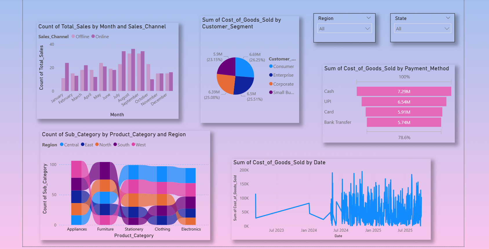
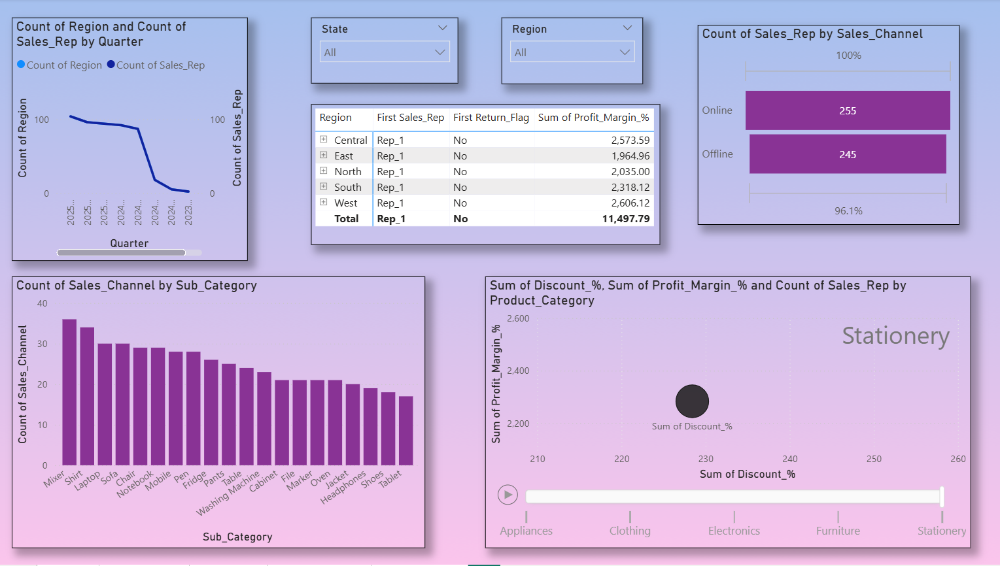
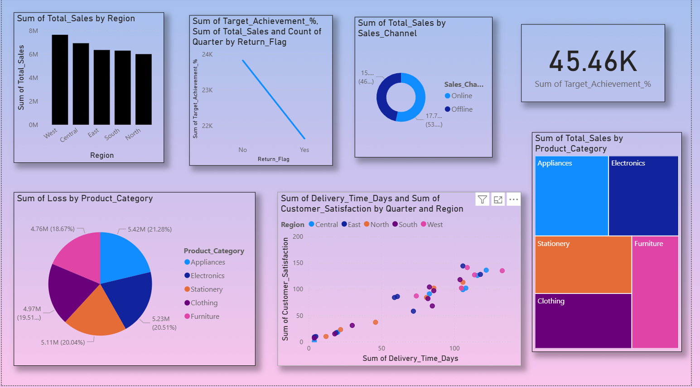

# Business_Insights_360
Power BI dashboard project showing business insights with a demo video.

## Overview
**Business Insights 360** is a Power BI analytics project that provides a complete 360-degree view of organizational performance by integrating **Sales, Finance, Marketing, and Executive dashboards** into a single interactive solution.
The project focuses on transforming raw business data into actionable insights to support **data-driven decision-making**.

## 🎥 Demo Video
▶️ Watch the full dashboard walkthrough on YouTube:  
https://youtu.be/Jmcc3PKi0Po?si=Ec3h-QruGJCagO3M

## Dataset
- Source: CSV business dataset (quarter-wise)
- Includes sales, revenue, profit/loss, customer segments, delivery performance, regions, and product categories

## Dashboards
- **Sales View** – Revenue, units sold, regional and category performance  
- **Finance View** – Profit, loss, COGS, discount impact  
- **Marketing View** – Customer segments, channels, returns, trends  
- **Executive View** – High-level KPIs and quarterly performance overview  

## Tools & Technologies
- Power BI Desktop  
- Power Query  
- DAX  
- CSV Dataset  

## Screenshots

### Home / Navigation Page

### Finance View Dashboard

### Sales View Dashboard

### Marketing View Dashboard

### Executive View Dashboard

## Files in Repository
- `Business Insights 360.pbix` – Power BI dashboard  
- `dashboard_demo.mp4` – Short walkthrough video  
- `README.md` – Project documentation  

## How to Use
1. Download the `.pbix` file  
2. Open with **Power BI Desktop**  
3. Explore dashboards using filters and slicers  

## Team
- **Purva Gourishankar Munde**
- **Sakshi Arvind Kairamkonda**

## Project Outcome
Built an end-to-end Power BI reporting solution that enables centralized analytics, KPI tracking, and executive-level insights for better business decisions.
